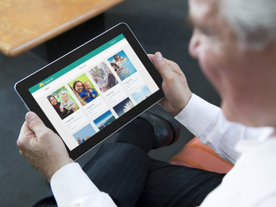
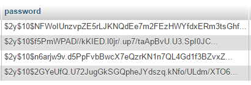

# About this project

This web app was developed as part of my Honours Project on the Web Design and Development course at Edinburgh Napier University.

I set out to make an easy to use social network website that was targeted at inexperienced older users. Through the incorporation of easy to use interfaces, accessibility options, responsiveness and modern web technologies, a web application was produced  in accordance with industry standard conventions and guidelines in order to provide an optimal user experience. 

## Beacon

Beacon is a social network website designed with the intention of being easy to use for people who may not be experienced in the use of digital technology, such as older generations who did not grow up using it. The overall aim of the website is to positively affect the lives of its users by allowing them to stay connected with family and loved ones by making the website accessible and easy to use. 

 

## Application Architecture 

During the design and development process it was important to make the web application not only function effectively, but also make use of best practises and maintain a good architecture to allow for easy extensibility. Although initially the website will be relatively small-scale, developing it using industry standard conventions and architecture will help to allow for scalability when implementing future development and enabling it to function as a large-scale, high traffic web application.

## Framework

Laravel was selected as the framework in which to develop the backend functionality of the website. Laravel’s security features, intuitive syntax and excellent online documentation were beneficial in developing the application.   

As the website is structured around an underlying database to store much of its content, it was critical to give sufficient time and thought to the design of the database prior to development 

## External Libraries & Services

Beacon makes use of several external libraries and services in order to provide functionality to various parts of the website. Explanations of what some of these services are and why they have been used are as follows. 

Pusher is a data delivery service that uses WebSockets to transmit and receive data in real-time. It was utilised to provide real-time functionality to the Messaging section of the website, allowing messages to be sent by users and instantly appear on the recipient’s screen without the need to refresh the page. 

Bootstrap, a front-end web framework used to help provide responsiveness to the web application, allowing it to display better on various devices.

## Security

As with the nature of social network sites, it is inevitable that user data will need to be stored in order for it to function correctly. 
It was important that an adequate level of clarity was provided as to how their data is used, stored, and protected. A number of precautions have been taken to ensure that user data is protected. 

An SSL certificate was issued by Comodo to provide HTTPS encryption for the website. Hyper Text Transfer Protocol Secure is the secure version of HTTP, meaning that all communications between the user and the website are encrypted. When a trusted SSL certificate is used during a HTTPS connection, users will see a green padlock icon in the browser address bar. 

Beacon incorporates the use of Cross-Site Request Forgery (CSRF) and Cross-Site Scripting (XSS) protection to prevent unauthorised requests to the server. When a page is loaded, a token is generated in the header. Any request sent to the server, for example, a form submission or AJAX request, must have a matching token to allow it to be accepted. 

Passwords stored in the database are hashed to improve security in case of a data breach

